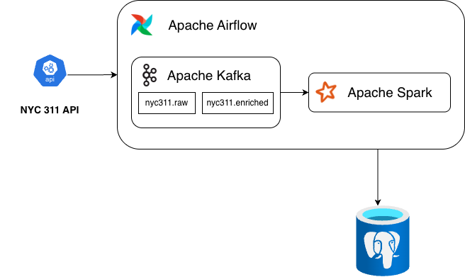

# NYC 311 Data Pipeline
## Overview
This project implements an **end-to-end data engineering pipeline** for ingesting, processing, and serving NYC 311 serving request data. 

The platform supports:
- Scalable ingestion of public API data
- Reliable storage for analytics

## High-level Architecture

The architecture is designed around **seperation of concerns**:

**Ingestion & Orchestration**
- Apache Airflow schedules and orchastrates data ingestion jobs
- The NYC 311 public API is polled at regular intervals.

**Streaming & Buffering**
- Apache Kafka decouples producers and consumers
- Two topics are used:
  - `nyc311.raw`: raw, unmodified API payloads
  - `nyc311.enriched`: cleaned and enriched records

**Processing**
- Apache Spark consumes data from Kafka
- Performs validation, cleaning, enrichment, and aggregations
- Outputs processed data for downstream analytics

**Storage**
- PostgreSQL stores analytics-ready datasets
- Optimized for fast querying and dashboard consumption

---

## Architecture Diagram

---

## Data Flow Summary
1. Airflow triggers ingestion tasks on a schedule
2. NYC 311 API data is published to the `nyc311.raw` Kafka topic
3. Spark processing and enriches the data
4. Enriched records are written to PostgreSQL

---

## Project Goals

The primary goals of this project are to:

- Demonstrate **real-world data engineering patterns**
- Showcase **event-driven and stream-based architectures**
