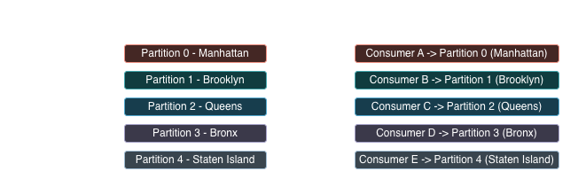

## `nyc311.raw` Kafka topic design
### Partitions
#### Partitions: 5

The topic is configured with **5 partitions**, corresponding to the five boroughs of NYC i.e Manhattan, Brooklyn, 
Queens, Bronx and Staten Island.

Using multiple partitions allows:
- Parallel message production
- Parallel consumption across consumer instances
- Higher throughput and better scalability

This setup makes it possible to process data independently per borough while still scaling consumers horizontally.

### Partition Strategy
#### Partition key: `borough`
Messages are produced using the `borough` field as the partition key.
- Events from the same borough are always written to the same partition
- Message ordering is preserved with each borough

If the `borough` field is **null or missing**, Kafka defaults to **round-robin partitioning**, ensuring:
- Even distribution of messages
- No producer failures due to missing keys

### Borough -> Partition Mapping

This mapping ensures:
- Borough-level data locality
- Deterministic partition assignment
- Horizontal scaling by adding consumers

### Retention Policy
#### Retention: 7 days
The topic retains messages for **7 days**, which is suitable for development and testing.

This allows:
- Replaying recent data during debugging
- Verifying consumer offset management
- Recovering from failures without long-term storage overhead

Retention settings can be adjusted for staging or producing environments as needed.